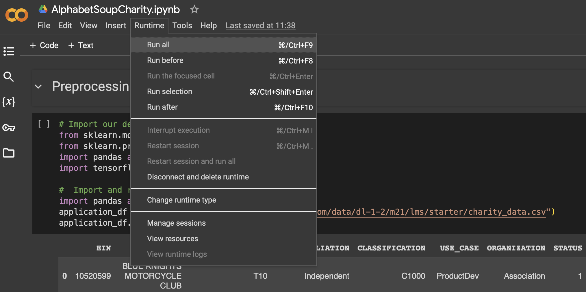

# Deep Learning Challenge - Alphabet Soup Charity

## Contents

1. [Overview](#1-overview)
2. [Repository](#2-repository)
3. [Deployment](#3-deployment)
4. [First Optimisation](#4-first-optimisation)
5. [Auto-optimisation with KerasTuner](#5-auto-optimisation-with-kerastuner)
6. [Summary](#6-summary)
7. [Recommendation](#7-recommendation)
8. [Resources](#8-resources)

## 1. Overview

The non-profit foundation Alphabet Soup requires a tool to select funding applicants with the highest chance of success in their ventures. Using machine learning and neural networks, this challenge involves creating a binary classifier to predict whether applicants funded by Alphabet Soup will be successful.

## 2. Repository

Jupyter Notebooks
- [`AlphabetSoupCharity.ipynb`](AlphabetSoupCharity.ipynb)
- [`AlphabetSoupCharity_Optimization.ipynb`](AlphabetSoupCharity_Optimization.ipynb)

Results
- `Results/AlphabetSoupCharity.h5`
- `Results/AlphabetSoupCharity_Optimization.h5`

## 3. Deployment

### Running the Test

- Sign in to Google Colab or any online Jupyter Notebook services that support deep learning libraries like TensorFlow. 
- Make sure all required libraries, including TensorFlow, are installed.
- Upload and run the following notebooks:
    - Initial model: AlphabetSoupCharity.ipynb
    - Optimised models: AlphabetSoupCharity_Optimization.ipynb

### Data Preprocessing

The machine learning model is trained using a CSV dataset containing over 34,000 organisations that have received funding from Alphabet Soup over the years. The following are the columns capturing metadata about each organisation:

Target
- IS_SUCCESSFUL: Effectiveness of fund usage

Features
- APPLICATION_TYPE: Alphabet Soup application type
- AFFILIATION: Affiliated sector of industry
- CLASSIFICATION: Government organisation classification
- USE_CASE: Use case for funding
- ORGANIZATION: Organisation type
- STATUS: Active status
- INCOME_AMT: Income classification
- SPECIAL_CONSIDERATIONS: Special considerations for application
- ASK_AMT: Funding amount requested

Dropped Variables
- EIN and NAME: Identification columns

Several steps are taken to clean the dataset and prepare it for machine learning:
- Identification variables like 'EIN' and 'NAME' are dropped as they do not contribute to the results.
- Application types (APPLICATION_TYPE) are categorised based on a threshold of 500. Types exceeding this threshold are treated individually, while those below are grouped under 'Other'. This simplifies analysis and reduces processing load.
- Similarly, a cut-off value of 1000 is applied to government organisation classification ('CLASSIFICATION'). Classification types below the threshold are grouped under 'Other'.
- All categorical data is converted to numeric data using pd.get_dummies.
- Data scaling is applied using StandardScaler().

### Compiling, Training, and Evaluating the Model
- The neural network model is trained using the TensorFlow library.
- By default, there are 2 hidden layers and 1 output layer.
    - First Hidden Layer: units = 80, activation = 'relu'
    - Second Hidden Layer: units = 30, activation = 'relu'
    - Output Layer: units = 1, activation = 'sigmoid'

- In our model architecture, we opt for the 'relu' activation function in hidden layers to enhance computational efficiency. The number of layers and units is carefully adjusted to match the dataset size, balancing the need for training accuracy with computational resources, ensuring optimal performance without excessive processing power.

- Model Compilation: The neural network is compiled with 'binary_crossentropy' loss, 'adam' optimizer, and 'accuracy' metric. This step configures the model for training by specifying how it should minimise errors and evaluate performance.

- Model Training: The compiled model is trained for 100 epochs using fit() with scaled training data (X_train_scaled) and labels (y_train). During training, the model learns patterns in the data to improve accuracy by adjusting its parameters iteratively.

Model Evaluation: The trained model is evaluated using the test data (X_test_scaled, y_test). This step calculates the loss and accuracy of the model's predictions on the unseen test dataset.

Model Export: Following evaluation, the model is saved to an HDF5 file format for future use. The file path for saving the model is defined as "AlphabetSoupCharity.h5", providing a convenient way to store and reuse the trained model.

### Results
- Model Performance: The evaluated model achieves a loss of approximately 0.5612 and an accuracy of about 72.98%. These metrics indicate the level of error and the model's predictive capability, respectively, on the test dataset.
- The achieved accuracy falls slightly below the target of 75%. Further optimisation techniques need to be explored and applied to enhance the model's performance and potentially improve the accuracy score.

## 4. First Optimisation

### Trial Learning by Changing Parameters

In this trial learning test, 3 optimisation changes are made in an attempt to increase the accuracy score:

1. Adjusting Train-Test Split Ratio: By introducing the test_size parameter in the train_test_split() function, the default train:test ratio of 75:25 is altered to a ratio of 80:20. This modification aims to increase the amount of training data available, with the expectation that a larger training set will potentially lead to improved model accuracy.
2. Adding an additional layer for training.
3. Adding the number of neurons in each layer.
    - First Hidden Layer: units = 100, activation = 'relu'
    - Second Hidden Layer: units = 50, activation = 'relu'
    - Third Hidden Layer: units = 25, activation = 'relu'
    - Output Layer: units = 1, activation = 'sigmoid'

### Results
- Model Performance: The evaluated model achieves a loss of approximately 0.6167 and an accuracy of about 72.62%.
- The achieved accuracy falls below the one achieved by the original model. Increasing the complexity of a model, such as adding more layers or neurons, can lead to overfitting. Overfitting occurs when the model learns to memorise the training data instead of generalizing patterns.

## 5. Auto-optimisation with KerasTuner

- KerasTuner Optimisation: KerasTuner is utilised to search for the optimal learning model tailored to the dataset's characteristics.
- Hyperparameters: The search space includes the number of layers (1-6) and the number of units in the first layer (1-10). Additionally, the choice of activation functions is explored, with options including 'relu', 'tanh', and 'sigmoid'.
- Resource Efficiency: To manage computational resources effectively, the parameter values are deliberately set to small ranges. This approach ensures that the optimisation process remains efficient while still producing effective model configurations.

### Results
- Model Performance: The best model achieves a loss of approximately 0.5622 and an accuracy of about 72.86%.
- Best Model
    - Activation': 'tanh'
    - Number of layers: 2
    - Number of units in the first layer: 7
- Despite tuning the model with a variety of parameters, the accuracy score consistently remains between 72% and 73%. This lack of improvement could stem from factors such as the dataset's quality or the possibility that the model has already reached a near-optimal state, leading to diminishing returns.

## 6. Summary

| Model | Accuracy | Loss |
|----|----|----|
| Original | 72.98% | 0.5612 |
| First Optimization | 72.62% | 0.6167 |
| Tuned by KerasTuner | 72.86% | 0.5622 |

The accuracy score consistently remains between 72% and 73%, without clear improvement shown in various optimization strategies. Although a variety of strategies can further be applied to tune the machine learning model, reaching the target of 75% accuracy can be a challenging task.

## 7. Recommendation

- Various basic supervised learning models (e.g. logistic regression, Support Vector Machine, etc.) can be applied to the dataset to test for an optimal learning model. 
- We may also consider the use of a random forest model. Random Forest offers several advantages in machine learning, it handles large datasets efficiently, reduces overfitting by averaging multiple decision trees, provides robustness to noisy data and outliers, requires minimal data preprocessing, and offers built-in feature importance estimation for better interpretability.
- Alternatively, several features or variables can be removed from the dataset during data processing stage.

## 8. Resources

- IRS. Tax Exempt Organization Search Bulk Data Downloads. https://www.irs.gov/
- Starter code is provided by EdX
